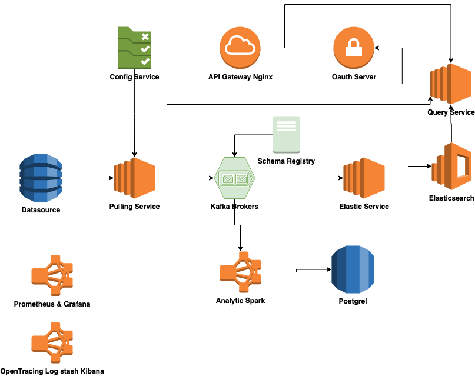

## Analytics platform projects

#### Architecture of projects

**Feature**:

    - Load data sets of texts send to kafka brokers
    - Ananlyze stocks :
        - Send every data point to ES
        - Spark aggregate average price of one stock each day
        - Top increasing/decreasing stock each day
        - Query service can get:
            - All above information
            - Data point